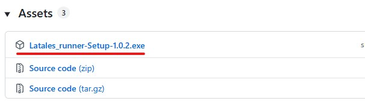
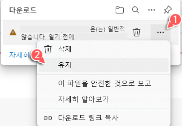
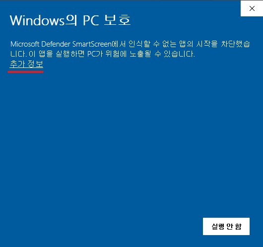

# LaTales_runner

라테일 캐릭터가 내 데스크톱 위를 자유롭게 돌아다니는 데스크톱 펫 프로그램입니다.

화면 위를 걸어 다니는 캐릭터를 마우스로 잡아서 다른 창 위에 올려둘 수도 있고, 원하는 코디로 자유롭게 꾸밀 수 있어요.

 

## 다운로드 및 설치

[Releases](../../releases) 페이지에서 최신 버전을 받아 실행하면 자동으로 설치됩니다.

Release 페이지 하단의 **Assets** 목록 파일 3개 중 **`Latales_runner-Setup-X.X.X.exe`** 하나만 받으시면 됩니다. 

- 관리자 권한이 필요 없고, 라테일 클라이언트를 따로 설치하지 않아도 바로 실행됩니다.
- 설치 후 우클릭 메뉴에서 언제든 최신 버전인지 확인/업데이트할 수 있습니다.

 

### 다운로드가 안 되거나 파일이 지워진다면

Edge/Chrome 등 브라우저가 "이 파일 형식은 일반적으로 다운로드되지 않습니다" 같은 경고를 띄우며 파일을 자동으로 지우는 경우 다음과 같이 다운로드 하시면 됩니다!  
배포용 인증서(코드 서명)가 없는 개인 제작 프로그램이라 생기는 안내일 뿐, 악성 파일이라서 뜨는 경고가 아니에요.

1. 다운로드 목록에서 파일 오른쪽의 **`...`(더보기)** 클릭
2. **자세히** 클릭해서 옵션 펼치기
3. **유지** 클릭

 

### 설치 파일 실행 시 "Windows의 PC 보호" 경고가 뜬다면

인증서로 서명되지 않은 프로그램이라 Microsoft Defender SmartScreen이 "인식할 수 없는 앱"이라는 경고를 띄울 수 있어요. 마찬가지로 정상적인 안내이니 아래처럼 진행하면 돼요.

1. **추가 정보** 클릭
2. 새로 나타나는 **실행** 버튼 클릭

## 사용법

- **좌클릭 드래그**: 캐릭터를 들어서 원하는 위치나 다른 창 위에 올려두기
- **우클릭**: 코디 편집 / 이모티콘 / 캐릭터 관리 / 크기·투명도 / 기타 설정 메뉴 열기

 

## 주요 기능

### 자유로운 코디 편집
헤어/피부/의상 등 원하는 조합으로 자유롭게 꾸미기 가능! 프리셋으로 저장/불러오기도 가능해요. 최대 5캐릭터 까지 각자 다른 코디로 동시에 둘 수 있어요

 

### 다른 창 위로 올라타기
화면(멀티 모니터 지원) 위를 자유롭게 다니고 열려있는 다른 창(브라우저, 탐색기 등) 위에도 올라갈수 있어요 

 

### 들어올리기 & 던지기
마우스로 들어올려서 원하는 곳에 놓을수 있습니다.  
높은곳에서 떨어지면 일반 착지와 다른 모션을 보여주며, 화면 양쪽 가장자리로 세게 던지면 핀볼처럼 벽에 튕기기도 해요

 

### 이모티콘 재생
게임 속 다양한 동작(이모티콘)을 즉시 재생하거나, 가만히 있을 때 자동으로 재생되도록 설정할 수 있어요.

 

### 크기 / 투명도 조절
캐릭터 크기와 투명도를 필요에 따라 조절할 수 있어요

 

### 그 외 세부 설정
윈도우 상호작용 켜기/끄기, 제자리에 서있기, Windows 시작 시 자동 실행 등을 지원합니다!

## 제작자
kimbap918

이 프로그램은 라테일(원작: Actoz Soft) 팬메이드 도구이며, 원작의 저작권은 Actoz Soft에 있습니다.
