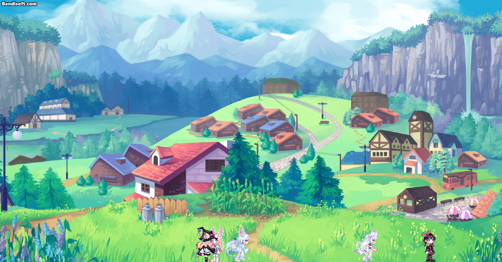
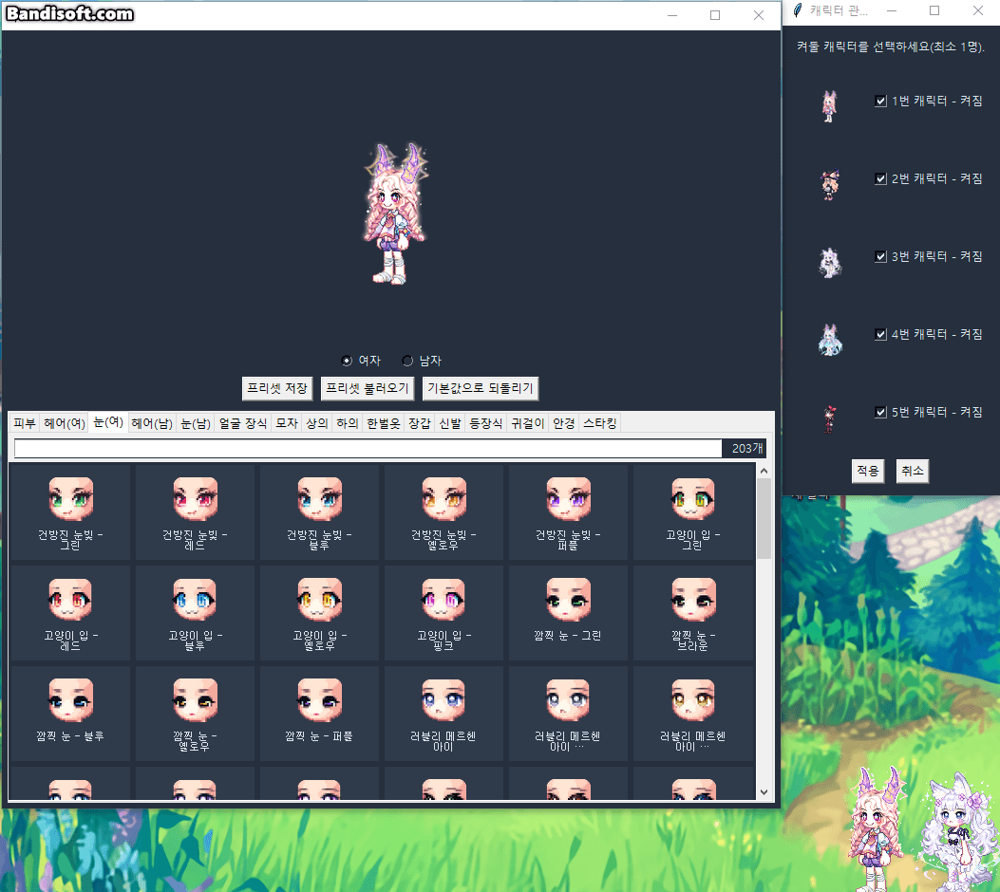
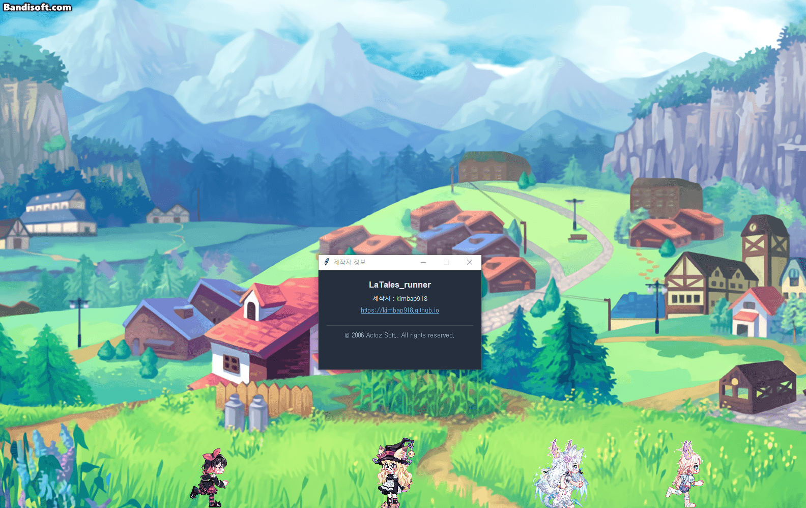
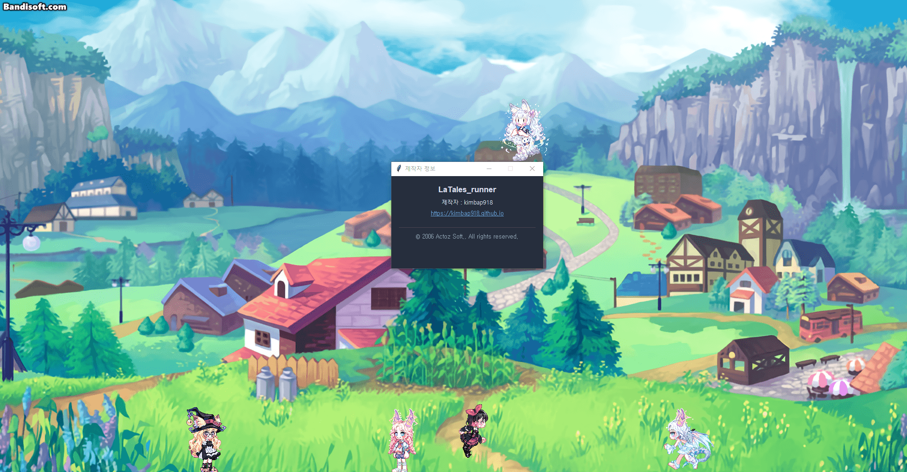
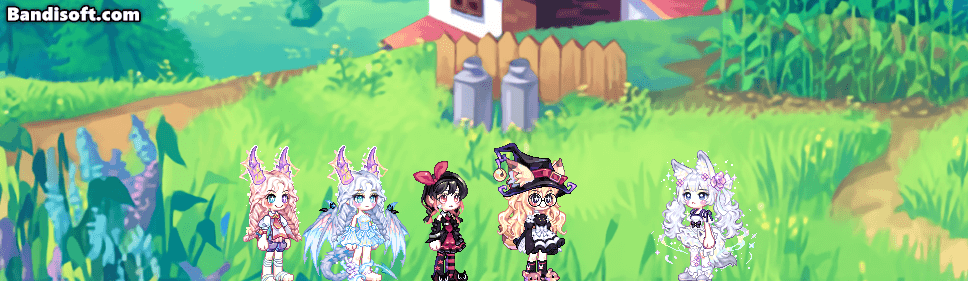
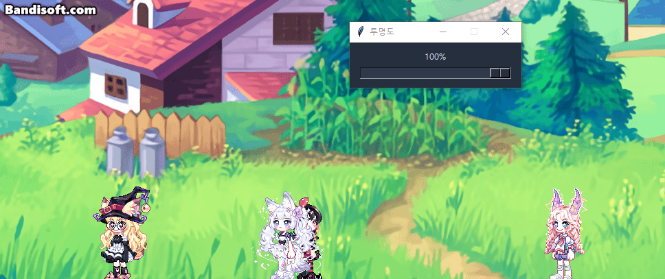
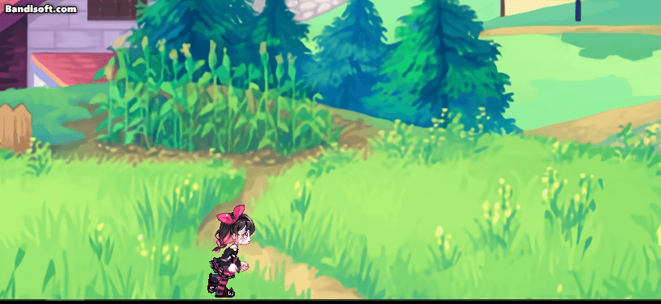

# LaTales_runner

라테일 캐릭터가 내 데스크톱 위를 자유롭게 돌아다니는 데스크톱 펫 프로그램입니다.

화면 위를 걸어 다니다가 마우스로 잡아서 다른 창 위에 올려둘 수도 있고, 원하는 코디로 자유롭게 꾸밀 수 있어요.

## 다운로드 및 설치

[Releases](../../releases) 페이지에서 최신 버전의 `Latales_runner-Setup-X.X.X.exe`를 받아 실행하면 자동으로 설치됩니다.

- 관리자 권한이 필요 없고, 라테일 클라이언트를 따로 설치하지 않아도 바로 실행됩니다.
- 설치 후 우클릭 메뉴에서 언제든 최신 버전인지 확인/업데이트할 수 있습니다.

## 사용법

- **좌클릭 드래그**: 캐릭터를 들어서 원하는 위치나 다른 창 위에 올려두기
- **우클릭**: 코디 편집 / 이모티콘 / 캐릭터 관리 / 크기·투명도 / 기타 설정 메뉴 열기

## 주요 기능

### 자유로운 코디 편집
헤어/피부/의상 등 원하는 조합으로 자유롭게 꾸밀 수 있고, 프리셋으로 저장/불러오기도 가능해요. 최대 5마리까지 각자 다른 코디로 동시에 키울 수 있어요.

### 다른 창 위로 올라타기
화면(멀티 모니터 지원) 위를 자유롭게 돌아다니다가, 열려있는 다른 창(브라우저, 탐색기 등) 위에도 자연스럽게 올라서요.

### 들어올리기 & 던지기
마우스로 들어올려서 원하는 곳에 놓거나, 세게 던지면 낙하 애니메이션이 자연스럽게 재생돼요. 화면 양쪽 가장자리로 세게 던지면 핀볼처럼 벽에 튕기기도 해요.

### 이모티콘 재생
게임 속 다양한 동작(이모티콘)을 즉시 재생하거나, 가만히 있을 때 자동으로 재생되도록 설정할 수 있어요.

### 크기 / 투명도 조절
캐릭터 크기와 투명도를 원하는 대로 조절할 수 있어요.

### 그 외 세부 설정
다른 창 위에 올라서기 켜기/끄기, 제자리에 서있기, Windows 시작 시 자동 실행 등을 지원해요.

## 제작자

kimbap918

문의나 버그 제보는 [Issues](../../issues)에 남겨주세요.

---

이 프로그램은 라테일(원작: Actoz Soft) 팬메이드 도구이며, 원작의 저작권은 Actoz Soft에 있습니다.
